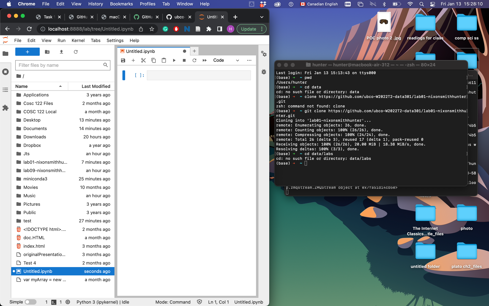

I want to code a new line that says print('hello people') 

 var name = window.prompt("Enter your Full Name:");
            var birthyear = window.prompt("Enter your Birth Year:");
            var d = new Date();
            var age = d.getFullYear()-birthyear;
            var bday = window.prompt("Have you had your birthday this year (Y/N)")

----
[link to a website](https://www.google.com)

|Fruit       | Colour      | Shape     | Size  |
|------------|-------------|-----------|-------|
|Banana      | Yellow      | Elongated | Long  |
|Peach       | Pink        | Circular  | Medium|
|Strawberries| Red         | Triangular| Small |
|Melon       | Yellow/Green| Circular  | Large |